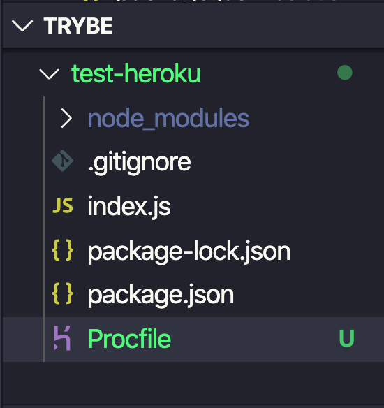

# Deploy 
A palavra deploy tem vários significados. Vai estar sendo utilizada para representar o processo de publicar uma aplicação em um servidor, tornando-a disponível para ser acessada local ou externamente.

# Introdução ao Heroku

O Heroku é um PaaS (Platform as a Service), o que significa que ele provém de uma plataforma em nuvem para configurarmos e realizarmos nosso deploy de maneira simples e fácil.

# Como funciona?

Para fazer um deploy com o Heroku , não é necessário realizar muitas alterações no projeto. O mais importante é o Heroku saber qual linguagem está sendo utilizada na sua aplicação e, caso esteja utilizando algum, qual o framework.
A partir dessas informações, o Heroku saberá, por exemplo, que é um projeto em Node.js e que, para executá-lo, ele terá que efetuar o comando descrito no campo scripts.start dentro do package.json (mais conhecido por npm start ).

# Procfile

O Procfile é um arquivo que especifica o comando que deve ser executado para iniciar o projeto. Além disso, o arquivo também especifica algumas características da sua aplicação, como, por exemplo, se seu projeto é um servidor web ou um job , se possui múltiplos processos ou apenas um etc.
O Procfile é definido em um arquivo chamado Procfile (exatamente assim, sem extensão 🤙) e deve localizar-se na raiz da sua aplicação. Caso o Heroku não encontre esse arquivo no momento do build , ele vai, conforme vimos anteriormente, tentar iniciar seu projeto da maneira padrão da linguagem/framework utilizada.

#
   


# Heroku remote

### Para adicionar o remote do Heroku , basta usar o comando create do CLI dentro da pasta da aplicação, da seguinte maneira:

```cmd
heroku create
```

### Para listar os remotes de seu projeto, execute o seguinte comando

```cmd
git remote -v
```

Após esse comando, liste novamente os remotes e você verá um novo remote chamado heroku , apontando para um repositório em https://git.heroku.com/ .

### Antes de executar novamente o comando heroku create , remova o heroku que já existe no remote da aplicação, caso contrário será criado um novo repositório no Heroku sem a associação a nenhum remote . Para excluir um remote:

```cmd
git remote rm heroku
```

### Para dar um nome específico para o repositório, você pode informá-lo logo após o comando heroku create , como mostrado no exemplo abaixo:
```cmd
heroku create meu-primeiro-deploy-2930
```

# Nomeação do remote

### Por padrão, o CLI vai nomear todos os remotes criados como heroku . Porém, podemos criar o nosso remote passando um nome diferente. Isso pode ser feito utilizando a flag --remote:

```cmd
heroku create meu-deploy-de-testes-29302 --remote heroku-homolog
```

### Podemos, também, renomeá-los utilizando o comando git remote rename . Vale lembrar que o comando abaixo não vai manter o remote heroku , ele vai renomear o remote heroku para heroku-origin .

```cmd
git remote rename heroku heroku-origin
```

## Fazendo deploy

### rode os seguintes comandos do git

```cmd
git add .
git commit -m 'Meu primeiro deploy no Heroku!'
```
### Para fazer deploy do seu app Heroku

```cmd
git push heroku-origin master ou main
```

## Acompanhando sua aplicação

### Após o deploy, seu serviço fica disponível em uma URL do Heroku, e o app pode ser gerenciado pelo CLI. Para listar os serviços que você tem em execução, utilize o comando apps:

```cmd
heroku apps
```

### Para ver os detalhes de um app específico, utilize o comando apps:info:

```cmd
heroku apps:info nome-do-seu-app-12345
```

## Variáveis de ambiente

### Caso o projeto possua variáveis de ambiente, você pode setá-las utilizando o comando config:set.

```cmd
heroku config:set TESTE="texto qualquer" --app nome-do-seu-app-12345
```
### Para listar as variáveis de ambiente, basta utilizar o comando config.

```cmd
heroku config --app nome-do-seu-app-12345
```

## Logs

### Para monitorar os logs dos apps , utilize logs

```cmd
heroku logs --app nome-do-seu-app-12345
```

### Por padrão, o comando retorna as últimas 100 linhas de logs. Caso você queira mudar isso, utilize o parâmetro --num our -n

```cmd
heroku logs -n 200 --app nome-do-seu-app-12345
```

### O parâmetro --tail ou -t abre uma sessão para mostrar em tempo real os últimos logs. Para retornar ao prompt , basta executar Ctrl+C 

```cmd
heroku logs --tail --app nome-do-seu-app-12345
```

## Removendo um app do Heroku

### É possível remover também um app que você publicou lá. Para isto utilize o comando heroku destroy através da sintaxe

```cmd
heroku destroy --app meu-deploy-de-testes-29302 --confirm meu-deploy-de-testes-29302
```